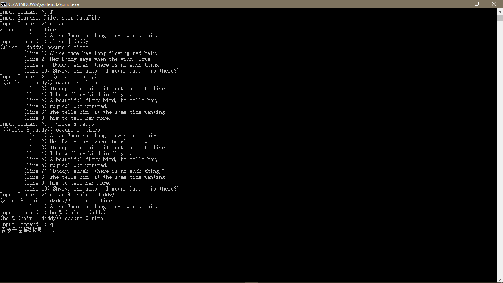

# TextQueryProgram
在给定的文件中查询单词

## 查询语法

word = [a_zA_z]

Term = word | "(" Expr ")"

Factor1 = Term | ~Term

Factor2 = Factor1 | Factor1 "&" Factor2
	    = Factor1 (ws "&" ws Factor2)*

Factor2 = Factor1 | Factor2 & Factor1
	     =  Factor1 (ws "&" ws Factor1)*

Expr = Factor2 (ws "|" ws Expr)*

Expr = Factor2 | Expr "|" Factor2
	 = Factor2 (ws "|" ws Factor2)*

## 使用方法

将所有源文件包含在一个文件夹中，然后`#include "Expression.h"`，即可使用程序相应的数据结构与接口。

以上传的`Main.cpp`，在Visual Studio Community演示效果：

